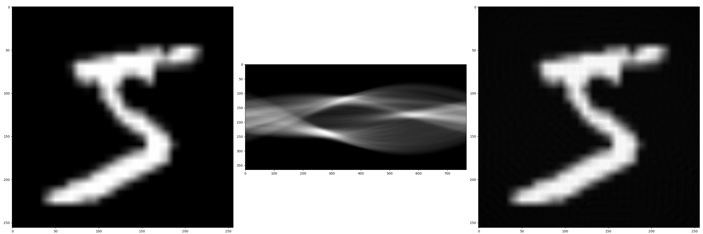

# Radon
This repository contains a Python/C++ implementation of the radon transform, based on pytorch and its JIT-C++-compilation feature.

## Features:
 - Forward and backward transforms
 - Filtering with different filters
 - Acceleration via CUDA/OpenMP
 - Differentiability
 - Generation of radon transform matrices

## Examples:

This image was generated using this package and a filter function generated by a machine learning algorithm. The left picture is an exemplary input from the MNIST dataset, the middle picture shows the corresponding sinogram and the right picture is the reconstruction using custom filtered backprojection.

 More examples can be found in `cpu_examples.ipynb` and `cuda_examples.ipynb`.

## Building+Requirements:
The base package requires only `pytorch` and a C++ compiler (`c++` on Unix/Linux, `cl` (MSVC) on Windows). The examples additionally require `jupyter notebooks`, `torchvision`, `matplotlib` and (optionally, for comparison) `torch_radon`.

To build:
 1. Clone the github repository via `git clone https://github.com/AlexanderAuras/radon.git`
 2. Change into the project directory and run run `pip install .` to install the package

## Roadmap:
 - PyPI/conda package
 - FIX: Find reason for difference to `torch_radon`
 - FIX: Find reason for pattern in cube reconstruction which does not exist with `torch_radon`
 - Support for different floating types
 - FIX: Remove duplicate code
 - Better detection of CUDA block size
 - More filter functions
 - Documentation
 - FIX: Normalization

## Finished:
 - ~~Fix CUDA backward bug~~
 - ~~Generate transform matrix~~
 - ~~Filtering as `nn.module`~~

## Known bugs:
 - On unix: `/usr/include/c++/11/bits/std_function.h:435:145: error: parameter packs not expanded with ‘...’`: caused by weird nvcc implementation, see https://github.com/NVIDIA/nccl/issues/650#issuecomment-1145173577